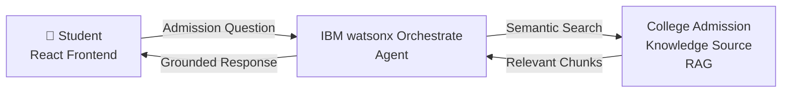

# AI College Admission Assistant

> A RAG-based AI admission guidance platform for **RISE Krishna Sai Prakasam Group of Institutions**, powered by **IBM watsonx Orchestrate**.

---

## Problem Statement

> **IBM SkillsBuild for University Engagements – AICTE 2026**

Prospective students seeking admission to engineering and management programmes often struggle to navigate complex, multi-step processes involving entrance exams, quota systems, eligibility criteria, fee structures, and document requirements. Information is scattered, frequently updated, and difficult to access outside office hours.

This project addresses that gap by deploying a **Retrieval-Augmented Generation (RAG) AI assistant** grounded in verified college admission knowledge, accessible directly from the institution's web portal — 24 × 7.

---

## Project Overview

The **AI College Admission Assistant** is a full-stack web application that provides students with instant, accurate, and grounded answers to admission-related queries for RISE Krishna Sai Prakasam Group of Institutions, Ongole, Andhra Pradesh.

The frontend is a professional college admission portal built with **React + TypeScript + Vite**. The AI assistant is embedded directly into the portal using the **IBM watsonx Orchestrate** embed SDK. The assistant is backed by a **College Admission Knowledge Source** — a curated collection of verified admission information — enabling the model to retrieve and ground its responses in factual, institution-specific data rather than relying on general world knowledge.

---

## Architecture



### How It Works

1. A student types a question into the AI assistant embedded in the web portal.
2. The query is sent to the **IBM watsonx Orchestrate** agent via the embed SDK.
3. The agent performs a **semantic search** over the **College Admission Knowledge Source** — a curated knowledge base of verified RISE KSP admission information.
4. The most relevant passages are retrieved and injected as context into the model prompt (RAG).
5. The model generates a **grounded response** — answers are based on retrieved facts, not hallucinated.
6. The response is returned to the student in the chat widget embedded in the portal.

> **Model:** The live agent currently uses **watsonx Orchestrate Frontier** as the underlying language model.

---

## Key Features

- **AI Admission Assistant** — IBM watsonx Orchestrate-powered chat widget embedded directly in the portal
- **RAG-Grounded Responses** — all AI answers are grounded in a verified College Admission Knowledge Source
- **Complete Admission Information Portal** — courses, eligibility, admission process, fee guidance, required documents, and FAQs
- **70 / 30 Quota Transparency** — Convener Quota (AP EAPCET / AP ICET) and Management Quota clearly explained
- **Fully Responsive UI** — desktop, tablet, and mobile-friendly layout
- **Professional Academic Design** — clean university-style interface built with Tailwind CSS
- **No Fake Chatbot** — the assistant makes real calls to the IBM watsonx Orchestrate agent; no simulated or hard-coded responses

---

## College Admission Knowledge Source

The knowledge source contains verified information about:

| Topic | Details |
|---|---|
| **Courses** | B.Tech (CSE, ECE, CSE-DS, CSE-AI&ML, EEE, MECH, CIVIL), MBA, MCA — with intake figures |
| **Eligibility** | B.Tech via AP EAPCET; MBA / MCA via AP ICET; qualification requirements per programme |
| **Admission Process** | 70% Convener Quota (APSCHE counselling) + 30% Management Quota |
| **Fee Structure** | Guidance on APFRC-regulated fees; directs students to verify current amounts with the institution |
| **Required Documents** | Marks memos, rank cards, allotment orders, certificates, Aadhar, photographs |
| **FAQs** | Common admission questions with verified answers |
| **Contact** | General: +91 8790145555 · Edu Verify: +91 8331938209 · NH-16, Valluru, Ongole – 523 272 |

---

## Courses Offered

### B.Tech (4 Years — AICTE Approved)

| Programme | Intake |
|---|---|
| Computer Science and Engineering (CSE) | 300 |
| Electronics and Communication Engineering (ECE) | 240 |
| CSE – Data Science | 120 |
| CSE – Artificial Intelligence & Machine Learning | 60 |
| Electrical and Electronics Engineering (EEE) | 60 |
| Mechanical Engineering | 60 |
| Civil Engineering | 60 |

### Postgraduate Programmes

| Programme | Intake |
|---|---|
| MBA | 60 |
| MCA | 120 |

---

## Eligibility

### B.Tech
- **Qualifying Exam:** 10+2 / Intermediate with Mathematics, Physics, and Chemistry (or equivalent)
- **Entrance Test:** AP EAPCET (mandatory for Convener Quota)
- **Convener Quota:** 70% of seats — allotted through AP EAPCET counselling by APSCHE
- **Management Quota:** 30% of seats — filled directly by the institution

### MBA
- **Qualifying Exam:** Any Bachelor's degree (10+2+3 pattern) from a recognised university
- **Entrance Test:** AP ICET (mandatory for Convener Quota)
- **Convener Quota:** 70% · **Management Quota:** 30%

### MCA
- **Qualifying Exam:** Bachelor's degree with Mathematics at 10+2 or graduation level
- **Entrance Test:** AP ICET (mandatory for Convener Quota)
- **Convener Quota:** 70% · **Management Quota:** 30%

> Eligibility norms are governed by APSCHE and are updated each academic year. Always confirm with the official APSCHE website and the admissions office before applying.

---

## Admission Process

1. **Appear in Entrance Exam** — AP EAPCET (B.Tech) or AP ICET (MBA/MCA)
2. **Obtain Rank Card** — from the official results portal
3. **Convener Web Counselling** — register on the APSCHE/Convener portal, exercise options, await allotment
4. **Report to College** — present original documents, pay the fee, confirm seat
5. **Management Quota** — contact the institution directly for procedure and availability
6. **Document Verification & Enrolment** — complete formalities to begin the academic programme

---

## Required Documents

### B.Tech
- SSC (Class 10) Marks Memo and Certificate
- Intermediate (Class 12) Marks Memo and Certificate
- AP EAPCET Hall Ticket and Rank Card
- AP EAPCET Seat Allotment Order (Convener Quota)
- Study Certificates (Classes 6 to Intermediate)
- Transfer Certificate (TC) and Migration Certificate
- Caste Certificate and Income Certificate (where applicable)
- Aadhar Card · Passport-size photographs

### MBA / MCA
- Bachelor's Degree Certificate and all Marks Memos
- AP ICET Hall Ticket and Rank Card
- AP ICET Seat Allotment Order (Convener Quota)
- TC, Migration Certificate, Caste Certificate, Income Certificate
- Aadhar Card · Passport-size photographs

---

## Example Questions Students Can Ask

The AI assistant is trained to answer questions such as:

- *"What is the eligibility for B.Tech CSE admission?"*
- *"How many seats are available for MBA?"*
- *"What is the difference between Convener Quota and Management Quota?"*
- *"Which documents do I need for MCA admission?"*
- *"Is Mathematics required for MCA?"*
- *"How do I apply for AP EAPCET counselling?"*
- *"What is the fee structure for B.Tech?"*
- *"What is the contact number for the admissions office?"*
- *"Where is RISE KSP located?"*
- *"Are scholarships available for SC/ST students?"*

---

## IBM watsonx Orchestrate Integration

The AI assistant is embedded using the **IBM watsonx Orchestrate** embed SDK. The configuration is declared in `frontend/index.html`:

```js
window.wxOConfiguration = {
  orchestrationID: "...",           // Orchestration ID
  hostURL: "https://jp-tok.watson-orchestrate.cloud.ibm.com",
  rootElementID: "wxo-chat-root",   // DOM element the widget mounts into
  deploymentPlatform: "ibmcloud",
  crn: "crn:v1:bluemix:...",        // IBM Cloud Resource Name
  chatOptions: {
    agentId: "..."                  // College Admission RAG Agent ID
  }
};
```

The widget mounts into `<div id="wxo-chat-root">` rendered by the `AIAssistant` React component. All agent configuration values are fixed and must not be modified.

> **Security note:** The embed configuration values shown above are non-secret public widget configuration parameters (similar to a public embed key). Do not commit any private API keys, IBM Cloud credentials, or watsonx service credentials to version control.

---

## Technologies Used

| Layer | Technology |
|---|---|
| **Frontend Framework** | React 19 + TypeScript 6 |
| **Build Tool** | Vite 8 |
| **Styling** | Tailwind CSS 4 |
| **AI Agent** | IBM watsonx Orchestrate (Frontier model) |
| **RAG** | IBM watsonx Orchestrate Knowledge Source |
| **Embed SDK** | IBM watsonx Orchestrate Chat Embed (`wxoLoader.js`) |

---

## Project Structure

```
playground/
├── frontend/                        # React + TypeScript + Vite frontend
│   ├── src/
│   │   ├── App.tsx                  # Root component — composes all page sections
│   │   ├── main.tsx                 # React entry point
│   │   ├── index.css                # Global styles (Tailwind import + base)
│   │   └── components/
│   │       ├── Header.tsx           # Fixed navigation bar + mobile menu
│   │       ├── Hero.tsx             # Full-screen hero section
│   │       ├── About.tsx            # Institution overview
│   │       ├── Courses.tsx          # B.Tech, MBA, MCA programme cards
│   │       ├── Eligibility.tsx      # Eligibility criteria per programme
│   │       ├── AdmissionProcess.tsx # Step-by-step admission process
│   │       ├── FeeStructure.tsx     # Fee guidance section
│   │       ├── Documents.tsx        # Required documents checklist
│   │       ├── ImportantInfo.tsx    # Verification reminders banner
│   │       ├── FAQs.tsx             # Accordion FAQ section
│   │       ├── AIAssistant.tsx      # IBM watsonx Orchestrate chat embed
│   │       ├── Contact.tsx          # Contact information
│   │       └── Footer.tsx           # Footer with quick links
│   ├── index.html                   # HTML shell + IBM Orchestrate embed script
│   ├── vite.config.ts               # Vite configuration
│   ├── tsconfig.json                # TypeScript configuration
│   └── package.json                 # Frontend dependencies
│
├── plans/
│   └── interviewiq-plan.md          # Backend architecture plan (separate project)
│
└── README.md                        # This file
```

---

## Local Setup

### Prerequisites

- **Node.js** 18 or later
- **npm** 9 or later

### Install Dependencies

```bash
cd frontend
npm install
```

### Start the Development Server

```bash
npm run dev
```

The application will be available at **http://localhost:5173**.

The IBM watsonx Orchestrate embed script in `index.html` loads the chat widget automatically when the page opens. The AI assistant will be fully functional as long as the configured agent is active.

### Production Build

```bash
npm run build
```

Build output is written to `frontend/dist/`. Serve the `dist/` folder with any static web server or CDN.

---

## Security Notice

> ⚠️ **Never commit private credentials to version control.**

- The values in `window.wxOConfiguration` in `index.html` are public widget configuration parameters (equivalent to a public embed key) and are intentionally present in the client-side code.
- Do **not** commit IBM Cloud API keys, watsonx service credentials, IAM tokens, or any private secrets.
- If the project is extended with a backend, copy `backend/.env.example` to `backend/.env`, fill in real values, and confirm that `.env` is listed in `.gitignore` before committing.

---

## Future Enhancements

- **Multi-language support** — Provide admission guidance in Telugu for regional accessibility
- **Application status tracker** — Allow students to check their counselling / application status
- **Deadline reminder system** — Push notifications for AP EAPCET / AP ICET key dates
- **IBM Granite integration** — Extend the backend to use IBM Granite generation and embedding models for on-premise or private deployment scenarios
- **Personalised course recommender** — Suggest programmes based on a student's academic background and interests
- **Admin knowledge-base editor** — Allow admission staff to update the RAG knowledge source without developer involvement

---

## Contact

**RISE Krishna Sai Prakasam Group of Institutions**

| | |
|---|---|
| General Contact | +91 8790145555 |
| Edu Verify | +91 8331938209 |
| Address | NH-16, Valluru, Ongole – 523 272, Prakasam District, Andhra Pradesh |

---

## Author

**Akhilesh Arikatla**
IBM Internship Project — AI College Admission Assistant
IBM SkillsBuild for University Engagements · AICTE 2026

---

*Built with React, TypeScript, Vite, Tailwind CSS, and IBM watsonx Orchestrate.*
